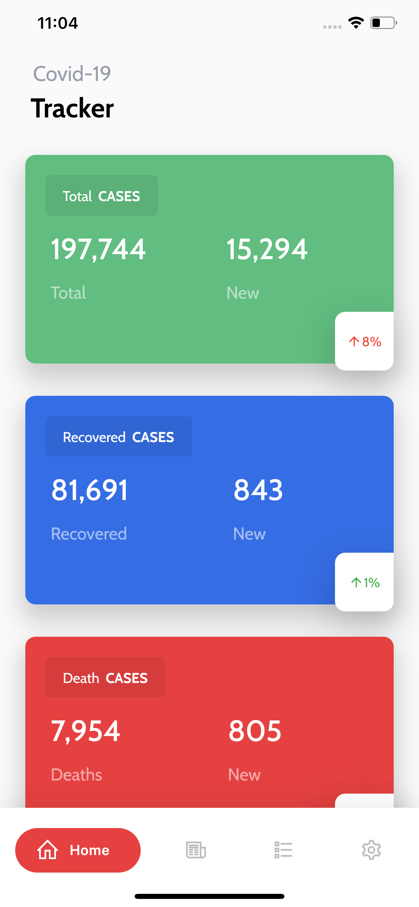
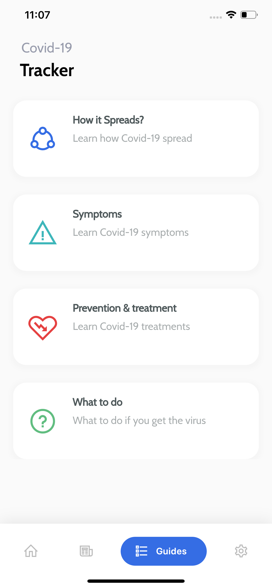

# 📈COVID-19 Tracker 
 

A simple Flutter app to track COVID-19 cases.
The data we provide is collected from [World Health Organization (WHO)](https://www.who.int/), the US [Centers for Disease Control and Prevention (CDC)](https://www.cdc.gov), the [Chinese Centre for Disease Control and Prevention (ECDC)](http://www.chinacdc.cn/en/), [China’s National Health Commission](http://en.nhc.gov.cn/), and Chinese website DXY which provides regional case estimates faster than the national level reporting organizations.

The [The Virus Tracker API](https://thevirustracker.com/api) was used to provide the data.
The [www.cdc.gov](https://www.cdc.gov) was used to provide the guides.

<!-- <a href="http://download1523.mediafire.com/47ofh2ic5wdg/tk77cflsp5alb6j/app-release.apk"></img></a> -->

## 💻 Requirements
* Any Operating System (i.e MacOS X, Linux, Windows)
* Any IDE with Flutter SDK installed (ie. IntelliJ, Android Studio, VSCode etc)
* A little knowledge of Dart and Flutter
* A brain to think 🤓🤓

## ✨ Features
- [x] See all cases statistics.
- [x] Read guides.

## 📸 Screenshots

&nbsp;

&nbsp;

## 🔌 Plugins
| Name | Usage |
|:------:|:-------:|
|[**flutter_bloc**](https://pub.dev/packages/flutter_bloc)| State Management|
|[**DIO**](https://pub.dev/packages/dio)| Network calls|
|[**WebView**](https://pub.dev/packages/webview_flutter)| InApp WebView|

## 🤓 Author(s)
**Ajiboye Temitope Oluwatayomi** 

## 🔖 License
[Apache-2.0](https://github.com/tayormi/covid_tracker/blob/master/LICENSE)

***
> Feel free to star ⭐ this repository if you like what you see 😉.