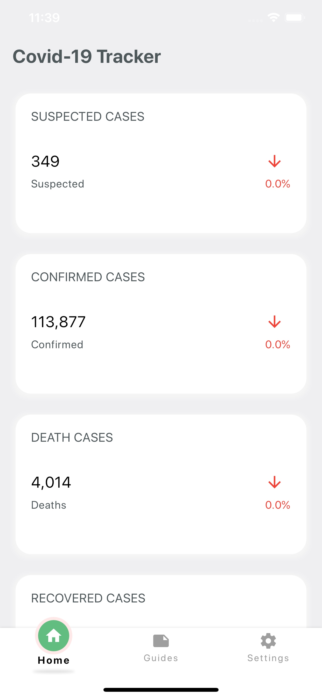
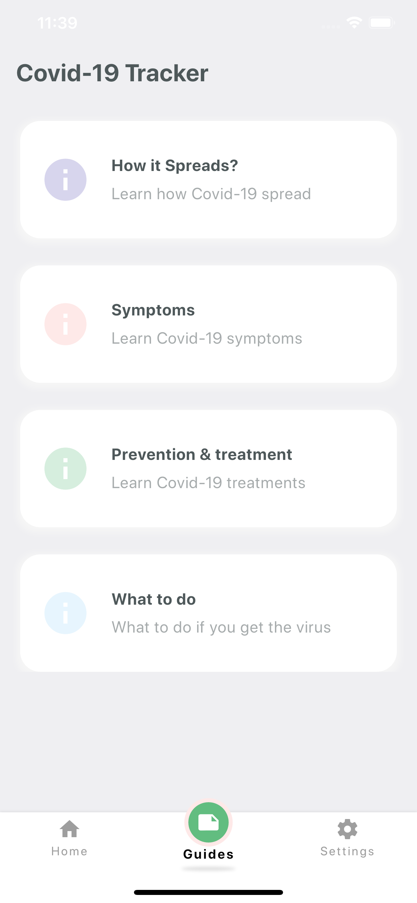

# 📖📖 Covid_99 Tracker  

A simple Flutter app to track Covid-99 cases.
The data we provide is collected from World Health Organization (WHO), the US Centers for Disease Control and Prevention (CDC), the Chinese Centre for Disease Control and Prevention (ECDC), China’s National Health Commission, and Chinese website DXY which provides regional case estimates faster than the national level reporting organizations..

 

The [Nubentos API](https://store.nubentos.com/store/apis/info?name=API-nCoV2019&version=1.0.0n) was used to provide the data.
The [www.cdc.gov](https://www.cdc.gov) was used to provide the guides.
 
 
<!-- <a href="http://download1523.mediafire.com/47ofh2ic5wdg/tk77cflsp5alb6j/app-release.apk"></img></a> -->
 
Please star⭐ the repo if you like what you see😉.

## 💻 Requirements
* Any Operating System (ie. MacOS X, Linux, Windows)
* Any IDE with Flutter SDK installed (ie. IntelliJ, Android Studio, VSCode etc)
* A little knowledge of Dart and Flutter
* A brain to think 🤓🤓

## ✨ Features
- [x] See all cases statistics.
- [x] Read guides.

## 📸 ScreenShots

|------|-------|
|||

## 🔌 Plugins
| Name | Usage |
|------|-------|
|[**flutter_bloc**](https://pub.dev/packages/flutter_bloc)| State Management|
|[**DIO**](https://pub.dev/packages/dio)| Network calls|
|[**WebView**](https://pub.dev/packages/webview_flutter)| InApp WebView|

## 🤓 Author(s)
**Ajiboye Temitope Oluwatayomi** 

## 🔖 LICENCE
[Apache-2.0](https://github.com/tayormi/covid_tracker/blob/master/LICENSE)